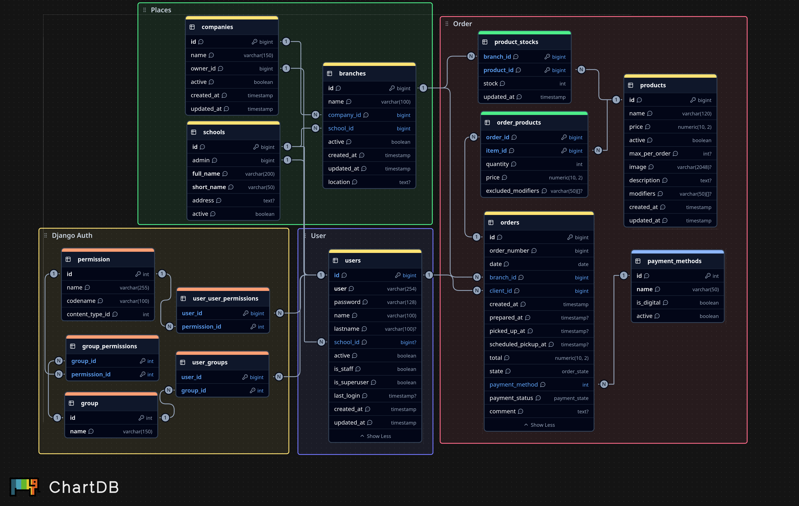

<div align="center">


**Sistema Gestor de Comedores Escolares**

*"Menos fila, menos hambre."*

[](https://nextjs.org/)
[](https://react.dev/)
[](https://www.typescriptlang.org/)
[](https://tailwindcss.com/)
[](https://www.djangoproject.com/)
[](https://www.postgresql.org/)
[](https://www.docker.com/)
</div>

# 📖 Descripción

Cooffy es un servicio web que conecta a **estudiantes y personal** con el **área de cocina** de una cafetería escolar. Permite realizar pedidos anticipados antes del receso, eliminando las filas y reduciendo la presión operativa en cocina. El sistema es responsive y accesible desde computadora, tablet o teléfono.

# ⚡ Funcionalidades principales

- **Pedidos anticipados** — Los estudiantes piden su comida antes del receso
- **Gestión de menús** — Platillos con foto, descripción, precio y promociones
- **Carrito de compra** — El cliente arma su pedido y elige método de pago (tarjeta o efectivo)
- **Seguimiento de órdenes** — Trazabilidad en tiempo real: *En espera → En preparación → Terminado → Entregado*
- **Control de inventario** — Capacidad máxima por platillo; se deshabilita al agotarse
- **Dashboard administrativo** — Métricas de ventas, pedidos y platillos más vendidos por sucursal
- **Gestión multi-sucursal** — Administración centralizada de sucursales, usuarios y roles

# 🚀 Setup

## Requisitos

- Node.js ≥ 20
- pnpm ≥ 9
- Python ≥ 3.12
- Docker y Docker Compose
- [uv](https://docs.astral.sh/uv/getting-started/installation/)
    <details>
    <summary>Como instalar uv</summary>

    - Mac/Linux:
    ```bash
    curl -LsSf https://astral.sh/uv/install.sh | sh
    ```

    - Windows:
    ```powershell
    powershell -ExecutionPolicy ByPass -c "irm https://astral.sh/uv/install.ps1 | iex"
    ```
    </details>

## Instalación

Clonar el repoitorio
```bash
git clone https://github.com/cooffyutt/cooffy.git
cd cooffy
```

Se necesita crear el archivo `.env` para las variables de entorno
```bash
cp .env.example .env
```

### Setup con Scripts

> Usando el [package.json](/package.json), se puede usar `pnpm` para ejecutar comandos desde la carpeta root

Script *all in one* para hacer todo el setup y empezar a correr el programa completo

```bash
pnpm init:all
```
#### Scripts individuales
Script solo para instalar
```bash
pnpm install:all    # Instalar front y back

pnpm back:install   # Instalar solo backend
pnpm front:install  # Instalar solo frontend
```

Script para iniciar proyectos
```bash
pnpm front      # Iniciar Nextjs
pnpm back:migrate    # Hacer migraciones a la base de datos
pnpm back       # Iniciar Django y docker-compose
```

Otro comando util para ejecutar `manage.py`
```bash
pnpm back:manage {parametro}
```

### Setup manual

Iniciar PostgreSQL con docker

```bash
docker-compose up -d
```

Iniciar el Frontend (NextJS)
```bash
cd frontend
pnpm install
pnpm dev
```
Iniciar el backend (Django)

**Pasos:**

1. **Navegar a la carpeta del backend**

```bash
cd backend
```

2. **Crear el entorno virtual**

```bash
uv venv
```

3. **Instalar dependencias**

```bash
uv pip install -r requirements.txt
```

4. **Ejecutar migraciones de base de datos**

```bash
uv run python manage.py migrate
```

5. **Crear datos base**

```bash
uv run python manage.py seed
```

6. **Iniciar el servidor**

```bash
uv run python manage.py runserver
```

El servidor estará disponible en `http://localhost:8000/`

**Nota:** El entorno virtual debe estar activado cada vez que abras una nueva terminal para trabajar en el backend.

# 📁 Estructura

```
cooffy/
├── frontend/          # Next.js + TypeScript + Tailwind
│   ├── src/
│   │   ├── app/       # Páginas y layouts (App Router)
│   │   ├── components/# Componentes React (shadcn/ui)
│   │   └── lib/       # Utilidades compartidas
│   └── public/        # Archivos estáticos
├── backend/           # API REST con Django + DRF
├── docker/            # Configuración de contenedores
├── docs/              # Documentación
└── docker-compose.yml
```

# ⚙️ Diagrama de Base de datos

La especificación de este diagrama se encuentra en [Tablas](docs/database/db_tables.md), el diagrama en `dbml` en [docs/DBML](docs/database/database.dbml) y fue hecho en [ChartDB](https://chartdb.neyzt.org)




# 🌿 Flujo de ramas

El proyecto utiliza un flujo de trabajo basado en Git para mantener un desarrollo organizado y facilitar la colaboración entre los integrantes del equipo.

### Ramas principales

- **main**: Contiene las versiones estables listas para producción.
- **develop**: Rama principal de desarrollo donde se integran todas las nuevas funcionalidades.

### Ramas de trabajo

Cada nueva tarea debe crearse a partir de `develop` utilizando alguno de los siguientes prefijos:

| Tipo | Ejemplo | Descripción |
|------|---------|-------------|
| `feature/` | `feature/login` | Nueva funcionalidad |
| `fix/` | `fix/login-validation` | Corrección de errores |
| `docs/` | `docs/update-readme` | Cambios en documentación |
| `chore/` | `chore/docker-compose` | Configuración, dependencias o CI/CD |
| `refactor/` | `refactor/auth-service` | Mejoras internas sin cambiar funcionalidad |
| `hotfix/` | `hotfix/login-crash` | Corrección urgente en producción |

### Flujo de trabajo

1. Actualizar la rama `develop`.
2. Crear una nueva rama para la tarea.
3. Realizar los cambios correspondientes.
4. Crear un Pull Request hacia `develop`.
5. Esperar la revisión y aprobación.
6. Hacer merge.
7. Eliminar la rama utilizada.

# 📝 Convención de commits

Este proyecto utiliza **Conventional Commits** para mantener un historial claro y consistente.

| Prefijo | Descripción |
|---------|-------------|
| `feat:` | Nueva funcionalidad |
| `fix:` | Corrección de errores |
| `docs:` | Cambios en documentación |
| `chore:` | Configuración, dependencias o tareas de mantenimiento |
| `refactor:` | Refactorización del código |
| `test:` | Agregar o modificar pruebas |
| `style:` | Cambios de formato sin afectar la lógica |

### Ejemplos

```bash
feat: add login page

fix: validate empty email

docs: update README

chore: configure docker compose

refactor: simplify authentication service
```

# 🧪 Bruno — API Client

[Bruno](https://www.usebruno.com/) es un cliente de APIs **open source** y **offline**, alternativa a Postman, que se integra con Git. Las colecciones se guardan como archivos de texto plano dentro del repositorio, lo que permite versionarlas y compartirlas con todo el equipo.

### Colecciones del proyecto

Las colecciones de Bruno se encuentran en la carpeta [`bruno/`](bruno/):

```
bruno/
├── workspace.yml
└── collections/
    ├── Auth/
    │   ├── Login.yml
    │   └── opencollection.yml
    ├── Products/
    |   ├── Menu Products.yml
    |   └── opencollection.yml
    └── ...
```

### Cómo usar la GUI de Bruno

1. [Descargar Bruno](https://www.usebruno.com/downloads) e instalarlo.
2. Abrir Bruno y hacer clic en **Open Workspace** (o **Open Collection**).
3. Seleccionar la carpeta `bruno/` de este repositorio.

### Bruno CLI (`bru`)

El proyecto incluye [`@usebruno/cli`](https://www.npmjs.com/package/@usebruno/cli) como dev-dependency en [`package.json`](package.json), para futuras automatizaciones y CI/CD.

```bash
# Ejecutar todas las requests de la colección Auth
pnpm bru:auth
```

También puedes usar `bru` directamente:

```bash
cd bruno/collections/<colección>
pnpm bru run
```