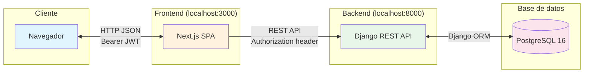

# Arquitectura de Cooffy

> Documentación general sobre decisiones técnicas de arquitectura del proyecto.  
> **Audiencia**: desarrolladores del equipo, evaluadores académicos y agentes de IA.

## 1. Stack tecnológico

| Capa | Tecnología | Justificación |
|------|-----------|---------------|
| Frontend | Next.js 16 (App Router) + React 19 | Aprender React con abstracciones modernas para trabajar más rápido y facilitar el uso con agentes de IA |
| Estado / HTTP | TanStack Query, Zustand, Axios | Abstracciones sobre fetching y estado global; caché automático, interceptores JWT |
| UI | Tailwind CSS 4 + shadcn/ui (base-nova) | Estilizado rápido sin escribir CSS, componentes accesibles copiados al repo, fácil de iterar con IA |
| Backend | Django 6 + Django REST Framework | Lo que se enseña en la universidad; ORM potente, admin automático, REST maduro |
| Auth | SimpleJWT | Fácil de implementar, tokens access/refresh sin sesiones de servidor |
| Base de datos | PostgreSQL 16 | Mejor que MariaDB/MySQL: JSON nativo, constraints, arrays, más integración con Django |
| Infraestructura | Docker Compose + uv + pnpm workspaces | Setup multiplataforma (Windows/Linux) sin fricción |

## 2. Estructura del proyecto

```
repo/
├── backend/                # Django 6 + DRF (Python 3.14, uv)
│   ├── config/             # settings.py, urls.py, wsgi.py
│   └── apps/               # Apps Django (users, products, branches, orders, ...)
├── frontend/               # Next.js 16 (App Router, Turbopack)
│   └── src/
│       ├── app/            # Rutas: /, /register, /menu, /kitchen, /manager
│       ├── components/     # Vistas y UI organizadas por funcionalidad
│       ├── hooks/          # useLoginForm, useRegisterForm
│       ├── context/        # CartContext (estado del carrito)
│       ├── lib/            # api.ts (axios), utils.ts (cn)
│       └── types/          # TypeScript: auth, kitchen, manager
├── bruno/                  # Colecciones de requests (Auth, Products, Orders, Branches)
├── docs/                   # Requerimientos, MVP, BD (diagrama en database/)
├── docker-compose.yml      # Solo PostgreSQL 16
├── .env.example            # Plantilla de variables de entorno
└── package.json            # Scripts raíz (pnpm): dev, init:all, back:manage
```

### Responsabilidades

| Componente | Responsabilidad |
|-----------|----------------|
| `backend/config/` | Configuración central de Django: settings, URLs raíz, WSGI |
| `backend/apps/` | Lógica de negocio organizada en apps Django (modelos, vistas, serializers, rutas) |
| `frontend/src/app/` | Rutas del App Router de Next.js. Cada carpeta = una página |
| `frontend/src/components/` | Componentes agrupados por panel: `login/`, `register/`, `menu/`, `kitchen/`, `manager/` |
| `frontend/src/context/` | Estado de carrito de compras vía React Context |
| `frontend/src/lib/api.ts` | Instancia de Axios configurada con interceptores JWT |
| `bruno/` | Colecciones de requests para probar la API manualmente |
| `docs/` | Documentación del proyecto: [requerimientos](requerimientos.md), [MVP](mvp_1.md), [base de datos](database/db_tables.md) |


## 3. Flujo de datos



### Flujos principales

**Autenticación**
1. El usuario envía credenciales desde el formulario de login
2. Next.js hace `POST /api/auth/login/` a Django
3. Django valida credenciales y devuelve access + refresh tokens JWT
4. El interceptor de Axios adjunta automáticamente `Bearer <token>` a todas las peticiones subsiguientes

**Consulta del menú**
1. El cliente accede a `/menu` → Next.js renderiza la vista de menú
2. `<MenuView>` llama a `GET /api/menu/products/` (JWT requerido)
3. Django devuelve productos paginados (activos, ordenables por nombre/precio/fecha)
4. El frontend muestra las tarjetas de producto con imagen, nombre, precio y descripción

**Carrito → Pedido**
1. El carrito se mantiene 100% en el frontend (React Context); no persiste en el servidor
2. Al confirmar la compra, el frontend envía `POST /api/orders/` con los productos anidados y método de pago
3. Django genera el número de orden, calcula el total automáticamente y devuelve la orden creada

**Ciclo de vida de un pedido (cocina)**
1. El panel de cocina (`/kitchen`) consulta `GET /api/orders/` filtrado por sucursal y estado
2. Las órdenes se muestran en columnas Kanban: `pending` → `preparing` → `ready` → `picked_up`
3. El empleado arrastra tarjetas entre columnas, lo que dispara `PUT /api/orders/{id}/` actualizando el estado

## 4. Patrones de diseño

### Auth stateless con JWT

- SimpleJWT emite tokens access (30 min) y refresh (14 días)
- Interceptor de Axios adjunta `Bearer <token>` automáticamente desde `localStorage`
- Al recibir 401, limpia localStorage y redirige al login
- DRF con `IsAuthenticated` global; endpoints públicos marcan explícitamente `permission_classes = []`

### Role-based routing

Cada rol de usuario tiene su panel dedicado:

| Rol | Ruta | Panel |
|-----|------|-------|
| Cliente | `/menu` | Menú de productos, carrito, checkout |
| Empleado / Gerente | `/kitchen` | Tablero Kanban de pedidos activos |
| Gerente | `/manager` | Gestión de sucursales, usuarios, dashboard |

Los guards en frontend (`KitchenView`, `ManagerView`) verifican `userData.groups` desde localStorage antes de renderizar.

### DRF ViewSets + Router

- `ReadOnlyModelViewSet` para recursos de solo lectura (productos del menú)
- `ModelViewSet` para recursos con CRUD completo (órdenes)
- `DefaultRouter` registra automáticamente las rutas REST estándar
- Búsqueda y ordenamiento declarativos via `search_fields` y `ordering_fields`

### Custom User model

- `USERNAME_FIELD = 'user'` — un solo campo que acepta email o username
- Hereda de `AbstractBaseUser` + `PermissionsMixin`
- Grupos de Django (`gerente`, `empleado`, `cliente`) para control de acceso por rol

### Carrito en Context API

- Estado local del frontend; no persiste en el servidor
- Se resuelve al crear la orden: el frontend envía los productos anidados en el POST
- Ventaja: sin requests extra durante la navegación del menú

### Conversión automática a WebP

Las imágenes de producto se convierten a WebP 800x800 (calidad 85) con nombre UUID al momento de subirlas, implementado en `Product.save()` vía Pillow. Esto evita imágenes pesadas en el menú sin intervención manual.

## 5. Infraestructura

### Variables de entorno

- **Un solo `.env`** en la raíz del repositorio
- `python-decouple` (`AutoConfig`) busca hacia arriba desde `backend/`, resolviendo variables sin duplicar archivos
- `NEXT_PUBLIC_API_URL` es consumida en build-time por Next.js para el `baseURL` de Axios
- Ver [`.env.example`](../.env.example) para las variables requeridas

### Docker

- En desarrollo **solo PostgreSQL** corre en contenedor: `docker compose up -d`
- Backend y frontend se ejecutan nativamente para facilitar el desarrollo (hot reload, debug)
- Para deploy, habrá configuración separada para empaquetar lo mayor posible con docker

### Gestión de paquetes

| Herramienta | Propósito | Alternativa reemplazada |
|-------------|-----------|------------------------|
| `uv` | Python: venv + pip | pip + venv (más lento, inconsistente entre SO) |
| `pnpm` | Node.js: workspaces + lockfile | npm (más lento, sin workspace nativo) |

Ambos garantizan instalaciones idénticas en Windows y Linux.

### Scripts principales

| Comando | Descripción |
|---------|-------------|
| `pnpm init:all` | Primer arranque: instala todo, levanta PostgreSQL, migra, seedea, inicia servidores |
| `pnpm dev` | Inicia backend y frontend simultáneamente (vía `concurrently`) |
| `pnpm back` | Solo el backend (`python manage.py runserver`) |
| `pnpm front` | Solo el frontend (`next dev --turbopack`) |
| `pnpm back:manage <args>` | Proxy a `manage.py` (ej. `pnpm back:manage makemigrations`) |

## 6. Referencia para agentes de IA

> Para lineamientos específicos de cómo trabajar en este repo — comandos, convenciones, configuración de entorno y errores comunes — consulta [`AGENTS.md`](../AGENTS.md).
